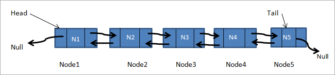

<div class="licence">
<span>Licence CC BY-NC-ND</span>
<div style="display:grid">
    <span>UE12-MINES-ParisTech</span>
</div>
<div style="display:grid">
    <span></span>
</div>
</div>

```c++
from IPython.display import HTML
HTML('<link rel="stylesheet" href="c++-slides.css" />')
```

#  exercice **la liste doublement chaînée**


## les conteneurs d'éléments


<div class = "framed-cell">
    <ins class = "underlined-title">les conteneurs d'éléments</ins>

<br>

dans un programme, vous êtes parfois amenés à devoir conserver des éléments d'un type donné (des entiers, des chaînes de caractères etc) tout au long de l'exécution

<br>

c'est pour cela, que sont proposées dans des libraries des structures de données que nous appelerons ici des conteneurs  
(parce qu'ils contiennent des éléments).

<br>

il existe différents types de conteneurs comme les vecteurs, les dictionnaires, les ensembles, les piles, les files ...

<br>

leur choix dépend de la fonctionnalité recherchée dans votre programme  
par exemple, pour la calculette, vous avez utilisé un conteneur avec un comportement de pile

<br>

leur complexité dépend de la structure de donnée sous-jacente, la recherche d'un élément dans un conteneur est classiquement en temps constant dans un dictionnaire, en temps linéaire dans une liste, en temps logarithmique dans un ensemble ...

<br>

mais ce sont là des notions que vous devez (re)connaître

</div>


## un exercice classique de programmation

<!-- #region -->
<div class="framed-cell">
<ins class="underlined-title">un exercice classique de programmation</ins>


<br>

La liste double chaînée est un exercice devenu un classique pour apprendre le c++ dans sa version *bas niveau* c'est à dire proche de la mémoire.

<br>

Cet exercice permet d'acquérir une compréhension fine des points suivants:


* les adresses mémoires (les fameux *pointeurs*)


* l'allocation en mémoire dynamique (*tas*, *heap*)


* la libération des zones mémoires inutiles tout au long du programme  
et pas uniquement lors de la destruction d'un objet à la fin de sa vie


* et (mais plus tard) les fonctions spéciales de construction par copie et d'affectation  
soit en les implémentant, soit en les supprimant avec `= delete`

</div>
<!-- #endregion -->

## mais un très mauvais conteneur !

<!-- #region -->
<div class="framed-cell">
<ins class="underlined-title">mais un très mauvais conteneur !</ins>


<br>Il faut par contre que les étudiants soient conscients que les conteneurs par liste chaînées, ne doivent surtout pas être utilisé dans les programmes

<br>

en `c++` il faut leur préférer des conteneurs beaucoup beaucoup plus efficaces comme le `std::vector`  
ou bien sûr des dictionnaires `std::unordered_map` lorsque leur utilisation se justifie

<br>

En effet les listes chainées en construisant un objet par élément (les cellules chaînées entre elles) vont
* d'une part *fragmenter*  la mémoire  
(i.e. y allouer plein de petits morceaux de mémoire à la place d'un gros bloc comme pour les tableaux)
* et, dans une moindre mesure, créent des indirections (aller chercher un objet à une adresse en mémoire) qui sont plus chères que des décalages  
(se déplacer en mémoire relativement à une adresse mémoire, comme dans le cas d'un tableau) 

<br>

les étudiants devraient avoir été sensibilisés à ces notions comme ils n'ont été à la complexité des algorihmes  

<br>

Ceci dit en préalable, penchons-nous sur les listes doublement chaînées

</div>
<!-- #endregion -->

## les types des éléments des conteneurs


<div class = "framed-cell">
    <ins class = "underlined-title">les types des éléments des conteneurs</ins>

<br>

le comportement d'un conteneur ne dépend pas du tout du type des objets qu'il contient

<br>

en  effet, que ce soit une pile d'entiers ou une pile de chaînes de caractères, son comportement restera celui d'une pile avec les fonctions pour empiler, dépiler

<br>

néanmoins pour simplifier cet exercice nous allons décider que nous implémenterons une liste chaînée pour stocker des entiers

<br>

une fois le conteneur codé, il sera alors le temps d'en faire un conteneur indépendant du type des éléments  
grâce aux `templates` mais cela sort du sujet de ce notebook

</div>


## la liste doublement chaînée

<!-- #region -->
<div class = "framed-cell">
    <ins class = "underlined-title">la liste doublement chaînée</ins>

<br>

c'est un conteneur d'éléments qui initialement est complètement vide  
i.e. aucun espace n'est réservé pour stocker les futurs éléments  
(alors qu'un vecteur ou un dictionnaire réservent de la mémoire pour stocker leurs éléments dès leur création)

<br>


dans une liste doublement chaînée, on peut ajouter un élément en tête de liste `add_front` ou en fin de liste `add_back`

<br>

ces deux opérations d'ajout doivent se faire en temps constant !  
donc pas question de parcourir toute la liste à partir de son début pour ajouter un élément en fin de liste !  
(vous transformeriez une opération normalement en temps constant en une opération en temps linéaire !)

<br>

lors de son ajout, l'élément est relié
* à l'élément qui le suit
* et à l'élément qui le précède

<br>

c'est pour cela qu'on appelle cette liste une liste *doublement* chaînée

<br>

si la liste doublement chaînée veut accéder à des éléments autres que le premier et le dernier  
elle doit parcourir la chaîne formée par les éléments

<br>

dessin d'une liste doublement chaînée



<br>

dans cet exercice vous devez définir deux classes, une pour la liste un pour la cellule de liste

<br>

comme les deux classes `IntCell` et `IntList` sont très liées

<br>

la classe `IntList` va manipuler les cellules de listes et doit donc accéder aux attributs de la classe `IntCell`

<br>

mais naturellement les attributs des classes des cellules sont en zone `private`

<br>

utilisez une déclaration `friend` afin que la class `IntCell` donne à la classe `IntList` le **droit** d'accéder à ses attributs et méthodes privées


<!-- #endregion -->

## les méthodes des classes

<!-- #region -->
<div class = "framed-cell">
    <ins class = "underlined-title">les méthodes des classes</ins>

<br>

nous vous proposons d'implémenter les méthodes suivantes:

1. le constructeur de liste sans arguments pour que le code suivant fonctionne
```c++
   IntList l;
```
1. la méthode `print` qui parcourt la liste à partir de son premier élément et affiche les éléments 
```c++
   l.print(); // {}
```
1. la méthode  `add_front` qui ajoute l'élément passé en argument en tête de la liste
```c++
   l.add_front(10);
   l.print(); // {10 }
```
1. la méthode `add_back` qui ajoute l'élément passé en argument en fin de la liste
```c++
   l.add_back(20);
   l.add_back(30);
   l.print(); // {10 20 30 }
```
1. la méthode `remove_front` qui enlève de la liste l'élément en tête de la liste (si il existe sinon ne fait rien)
```c++
   l.remove_front();
   l.print(); // {20 30 }
```
* la méthode `remove_back` enlève de la liste l'élément en fin de la liste (si il existe sinon ne fait rien)
```c++
   l.remove_back();
   l.print(); // {20 }
```
* la méthode `remove` enlève de la liste l'élément, dont la valeur est passée en argument  
(une liste peut contenir plusieurs fois le même élément vous n'en enlevez qu'un)
```c++
   l.remove(10);
   l.print(); // {20 }
   l.remove(20);
   l.print(); // {}
```
```c++
   l.add_front(1);
   l.add_front(1);
   l.print(); // {1 1 }
   l.remove(1);
   l.print(); // {1 }
```
* `search` rend `true` si l'élément, dont la valeur est passée en argument, existe dans la liste  
`false` sinon
```c++
   std::cout << std::boolalpha << l.search(27); // false  
   l.add_back(123);
   std::cout << std::boolalpha << l.search(123); // true  
```
1. Voyez-vous une autre méthode à ajouter ?
</div>
<!-- #endregion -->
